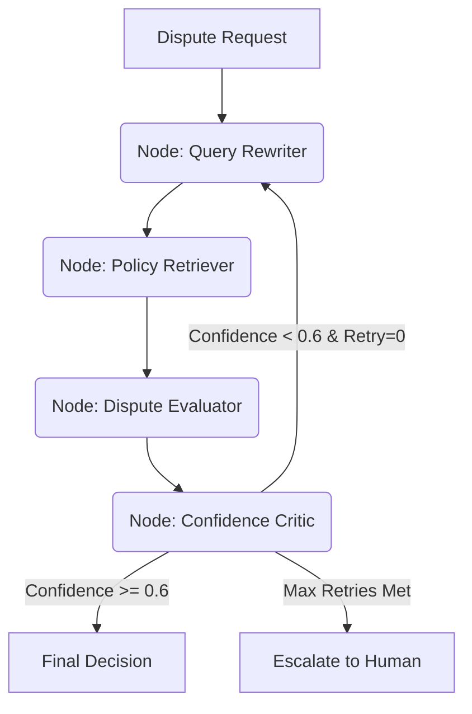
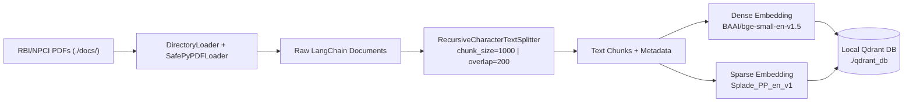

# 🛠️ Technical Specification: Autonomous Financial Dispute Decision Engine

---

## ⚡ Interview Brief (TL;DR)

> An **agentic RAG system** that autonomously resolves banking disputes (UPI/IMPS/Cards) against RBI/NPCI regulations — zero human intervention, $0/month infra cost.

---

### 🗂️ Data Ingestion Pipeline

```
./docs/*.pdf
   ↓  DirectoryLoader + SafePyPDFLoader   (skips corrupted PDFs gracefully)
   ↓  RecursiveCharacterTextSplitter      chunk_size=1000 chars, overlap=200 chars
   ↓  Splits on: \n\n → \n → ". " → " "  (respects legal paragraph boundaries)
   ↓  Each chunk carries metadata: source filename + page number
   ↓  Batch upload to Qdrant in groups of 25
   ↓  FastEmbed auto-computes Dense + Sparse vectors per chunk on CPU
   ↓  Stored in local Qdrant collection: "financial_policies"
```

**Why 1000/200?** — A policy sub-clause is ~150–200 tokens. 1000 chars fits one full clause; 200-char overlap (20%) prevents a sentence from being cut across two chunks.

---

### 🔍 Retrieval (at query time)

```
Dispute JSON → Query Rewriter → natural language query string
   ↓  qdrant_client.query(query_text=..., limit=3)
   ↓  Qdrant internally computes Dense + Sparse vectors for the query
   ↓  Reciprocal Rank Fusion (RRF) merges both ranked lists
   ↓  Top-3 chunks returned with score + source metadata
   ↓  Chunks joined with "\n\n---\n\n" → injected into LLM system prompt
```

---

### 📊 Metrics Tracked

| Metric | Value / Signal | Where |
| :----- | :------------- | :---- |
| `confidence` | 0.0–1.0 · < **0.6** → retry loop fires | `DecisionResponse` (Pydantic) |
| `risk_score` | 0.0–1.0 · fraud probability | `DecisionResponse` (Pydantic) |
| `policy_clause` | e.g. `"NPCI-ODR-Rule-5.2"` · legal traceability | `DecisionResponse` (Pydantic) |
| Retrieval score | RRF-fused hit score per chunk · logged as `res.score` | Qdrant query result |
| Source attribution | Which PDF + page the chunk came from · `res.metadata['source']` | Qdrant query result |
| Token usage | Input + output tokens per node | Langfuse trace span |
| LLM latency | ms per Groq API call | Langfuse → `evaluator` span |
| Embedding latency | ms for FastEmbed dense + sparse | Langfuse → `query_rewriter` span |
| Retry rate | % of disputes that hit the reflection loop | Langfuse dashboard |
| Clause frequency | Which rules are most cited across disputes | Langfuse dashboard |

---

### 🧱 Stack at a glance

`FastAPI` → `LangGraph` (3 nodes) → `Qdrant` (local, hybrid) → `Groq / Llama 3.3 70B` → `Pydantic` output → `MongoDB` audit → `Langfuse` traces

**Key numbers:** chunk 1000/200 · 384-dim dense · Splade sparse · top-3 RRF retrieval · confidence gate 0.6 · batch size 25 · <2 GB RAM

---

## 1. System Overview

The **Autonomous Financial Dispute Decision Engine** is an agentic AI system designed to evaluate banking transaction disputes (UPI, IMPS, Cards) against real-world regulations (RBI, NPCI) with **0 human intervention**.

### 🎯 Key Design Goals:

- **$0/month Budget**: Utilizing high-performance free-tier LLM APIs (Groq) and local CPU-optimized embedding models/vector databases.
- **Agentic Reasoning**: Moving beyond simple "Ask LLM" prompts to a state-aware reasoning graph using **LangGraph**.
- **Audit-First Compliance**: Every decision includes a mandatory reasoning chain and a specific policy clause for legal traceability.

---

## 2. Agentic Architecture (LangGraph)

The core logic is implemented as a **Directed Acyclic Graph (DAG)** that ensures deterministic execution while allowing for iterative reflection.

### 🔄 The Reasoning Workflow:



### 🧱 Node Breakdown:

1.  **Query Rewriter**: Transforms the raw JSON request (amount, status, bank) into a natural language search query optimized for Vector Retrieval.
2.  **Dispute Evaluator**: A "Senior Compliance Officer" LLM prompt that receives the context (policies) and inputs and generates a structured Pydantic response.
3.  **Confidence Critic**: Inspects the `confidence` score. If the model is uncertain, it triggers a "Self-Reflect" loop back to query rewriting with better context hints.

---

## 3. High-Precision RAG (Hybrid Search)

To handle complex banking rules, the system employs **Hybrid Retrieval** in **Qdrant**.

### 🔎 Search Strategy

- **Dense Vector Search** — Model: `BAAI/bge-small-en-v1.5` (384-dim). Captures **semantic intent** (e.g., "money not returned" → matches refund policy paragraphs).
- **Sparse Vector Search** — Model: `prithivida/Splade_PP_en_v1`. Captures **keyword precision** (e.g., exact rule codes like "Rule 5.2", "UPI-ODR", "NACH").
- **FastEmbed (Local CPU)**: Both models run fully on-device via `qdrant-client`'s built-in FastEmbed integration — zero cloud embedding cost.
- **Score Fusion**: Qdrant uses **Reciprocal Rank Fusion (RRF)** internally to combine dense and sparse scores into a single ranked list.

### 📦 Data Ingestion & Chunking Pipeline



#### Chunking Parameters — Why These Values?

| Parameter      | Value | Rationale |
| :------------- | :---- | :-------- |
| `chunk_size`   | 1000 chars | Fits one complete policy sub-clause (≈150–200 tokens); enough context for the LLM without exceeding prompt limits. |
| `chunk_overlap` | 200 chars | Prevents regulation sentences from being split mid-rule; 20% overlap preserves cross-boundary context. |
| `length_function` | `len` (char count) | Simple, deterministic; no tokeniser dependency. |
| Splitter type  | `RecursiveCharacterTextSplitter` | Tries `\n\n` → `\n` → `. ` → ` ` as split points in order, respecting natural paragraph/sentence boundaries in legal text. |

#### Ingestion Steps (as implemented in `ingest_docs.py`)

1. **Load**: `DirectoryLoader` crawls `./docs/**/*.pdf` using `SafePyPDFLoader` (a fault-tolerant wrapper that skips corrupted PDFs instead of crashing).
2. **Chunk**: `RecursiveCharacterTextSplitter` produces `N` chunks, each carrying LangChain `metadata` (source filename, page number).
3. **Batch Upload**: Chunks are uploaded to Qdrant in **batches of 25** using `client.add()`, which triggers FastEmbed to compute both dense and sparse vectors server-side before indexing.
4. **Collection Reset**: On each reingest, the existing collection is **deleted and recreated** to avoid stale/duplicate data.

### 🔍 Retrieval at Query Time (as implemented in `advanced_rag.py`)

```python
results = qdrant_client.query(
    collection_name="financial_policies",
    query_text=query,   # single call triggers both dense + sparse
    limit=top_k         # default: top 3 chunks
)
```

- `top_k = 3` — returns the 3 highest-scoring chunks after RRF fusion.
- Retrieved chunks are concatenated with `\n\n---\n\n` separators and injected directly into the LLM's system prompt as `AVAILABLE POLICIES`.

---

## 4. Evaluation & Observability Metrics

### 📊 RAG Retrieval Metrics

These are tracked per-query to monitor retrieval quality:

| Metric | Description | Tracked Via |
| :----- | :---------- | :---------- |
| **Retrieval Score** | Qdrant hybrid score for each returned chunk (RRF-fused dense + sparse). Logged per hit via `res.score`. | `ingest_docs.py` test query at end of pipeline |
| **Top-K Hits** | Number of chunks returned (`limit=3` by default). | `advanced_rag.py` |
| **Source Attribution** | `res.metadata.get('source')` — which PDF file + page the chunk came from. | `ingest_docs.py` retrieval test |
| **Chunk Coverage** | Total chunk count post-split. Logged as: `"Created N chunks."` | `ingest_docs.py` |

### 🧠 Agent Decision Metrics (via `DecisionResponse` schema)

Every LLM evaluation produces a **structured Pydantic output** with these fields used as quality signals:

| Field | Type | Purpose |
| :---- | :--- | :------ |
| `confidence` | `float` (0.0–1.0) | LLM self-assessed certainty. Below **0.6** triggers a retry loop via the Critic node. |
| `risk_score` | `float` (0.0–1.0) | Probability the dispute is fraudulent/high-risk. |
| `decision` | `str` | Final ruling: e.g., `"Auto Refund Eligible"`, `"Escalate to Human"`. |
| `policy_clause` | `str` | Specific rule cited (e.g., `"NPCI-ODR-Rule-5.2"`). Enables legal traceability. |
| `reasoning_chain` | `List[str]` | Step-by-step logic trace from the LLM. Auditable chain-of-thought. |

### ⏱️ Latency & Throughput Metrics

| Metric | Description | How to Measure |
| :----- | :---------- | :------------- |
| **End-to-end latency** | Time from `/evaluate` POST to JSON response | `run_latency_test.py` (included in repo) |
| **LLM inference time** | Groq API call duration (Llama 3.3 70B) | Langfuse trace → `evaluator` node span |
| **Embedding latency** | FastEmbed dense + sparse computation time | Langfuse trace → `query_rewriter` node span |
| **Qdrant query time** | Time for hybrid retrieval round-trip | Langfuse trace → retrieval span |

### 👁️ Langfuse Observability — Trace Structure

Every request produces a **Langfuse trace** with this hierarchy:

```
Trace: evaluate_dispute (dispute_id)
├── Span: query_rewriter
│   ├── Input: DisputeRequest JSON
│   └── Output: natural_language_query + retrieved_policies
├── Span: evaluator
│   ├── Input: policies + dispute fields
│   ├── LLM Call: llama-3.3-70b-versatile (token_count, latency_ms)
│   └── Output: DecisionResponse JSON
└── Span: critic
    ├── Input: confidence score
    └── Output: route decision (retry | end)
```

**Key metrics visible in Langfuse dashboard:**
- Token usage per node (input + output tokens)
- LLM latency (ms) per call
- Confidence score trend over time
- Retry rate (% of disputes hitting the reflection loop)
- Policy clause frequency (which rules are most cited)

---

## 5. Technology Stack & Infrastructure

| Component         | Technology                                      | Role                                                   |
| :---------------- | :---------------------------------------------- | :----------------------------------------------------- |
| **Orchestration** | LangGraph + LangChain                           | State machine & Agent logic                            |
| **Logic Layer**   | Llama 3.3 70B Versatile (Groq)                  | High-speed LLM for complex reasoning                   |
| **Vector DB**     | Qdrant (Local Path `./qdrant_db`)               | Local disk-based vector storage with hybrid indexing   |
| **Dense Embed**   | `BAAI/bge-small-en-v1.5` via FastEmbed          | 384-dim semantic vectors, CPU-optimised (<2GB RAM)     |
| **Sparse Embed**  | `prithivida/Splade_PP_en_v1` via FastEmbed      | Keyword-level SPLADE vectors for rule-code matching    |
| **Ingestion**     | LangChain `RecursiveCharacterTextSplitter`      | 1000/200 char chunks from `DirectoryLoader` + `PyPDFLoader` |
| **Audit Log**     | MongoDB Atlas (M0 Free Tier)                    | Persistent storage of every decision + context         |
| **Observability** | Langfuse                                        | Full trace transparency (input → reasoning → result)   |
| **Frontend**      | Vanilla JS + Tailwind CSS                       | Premium "Dark Cocoa" Dashboard                         |
| **API Framework** | FastAPI + Pydantic                              | High-performance REST interface with schema validation  |

---

## 6. Security & Observability

### 🛡️ Post-Evaluation Auditing

- Every dispute evaluation is logged into **MongoDB Atlas** via an asynchronous `BackgroundTasks` call. This prevents logging latency from affecting user response time.
- Logs include: Raw Input, Retrieval Context, Reasoning Chain, and Final JSON Decision.

### 👁️ Langfuse Integration

The engine provides deep observability into the LLM logic by piping traces to **Langfuse**. This allows engineers to see:

- Exactly which policy chunks were retrieved (source file + page).
- Token counts and latency per node.
- Confidence score history and retry rate patterns.
- Which policy clauses are most frequently cited.

---

## 7. Implementation Notes

- **Structured Outputs**: The engine enforces strict schema validation using **Pydantic**. If the LLM produces malformed JSON, the Pydantic parser catches it, and the agent reflects on the error.
- **Local CPU Optimization**: By using `BAAI/bge-small-en-v1.5` (384-dim, ~130MB), the entire embedding/vector search stack runs on < 2GB RAM, making it suitable for standard VPS or Home Server deployment.
- **Fault-Tolerant Ingestion**: `SafePyPDFLoader` wraps `PyPDFLoader` to catch and skip corrupted PDFs, ensuring the ingestion pipeline never crashes on a bad document.
- **Batch Ingestion**: Chunks are uploaded in batches of 25 to avoid memory spikes during large document ingestion.

---

## 🚀 Future Roadmap

- **Human-In-The-Loop (HITL)** UI for approving/rejecting agent decisions.
- **Cross-Encoder Reranking** for even higher precision in the RAG node (e.g., `ms-marco-MiniLM-L-6-v2`).
- **Vision Integration** for OCR of transaction screenshots using local models.
- **Automated RAG Evaluation**: Integrate RAGAS framework to score `context_precision`, `context_recall`, and `answer_faithfulness` offline.
